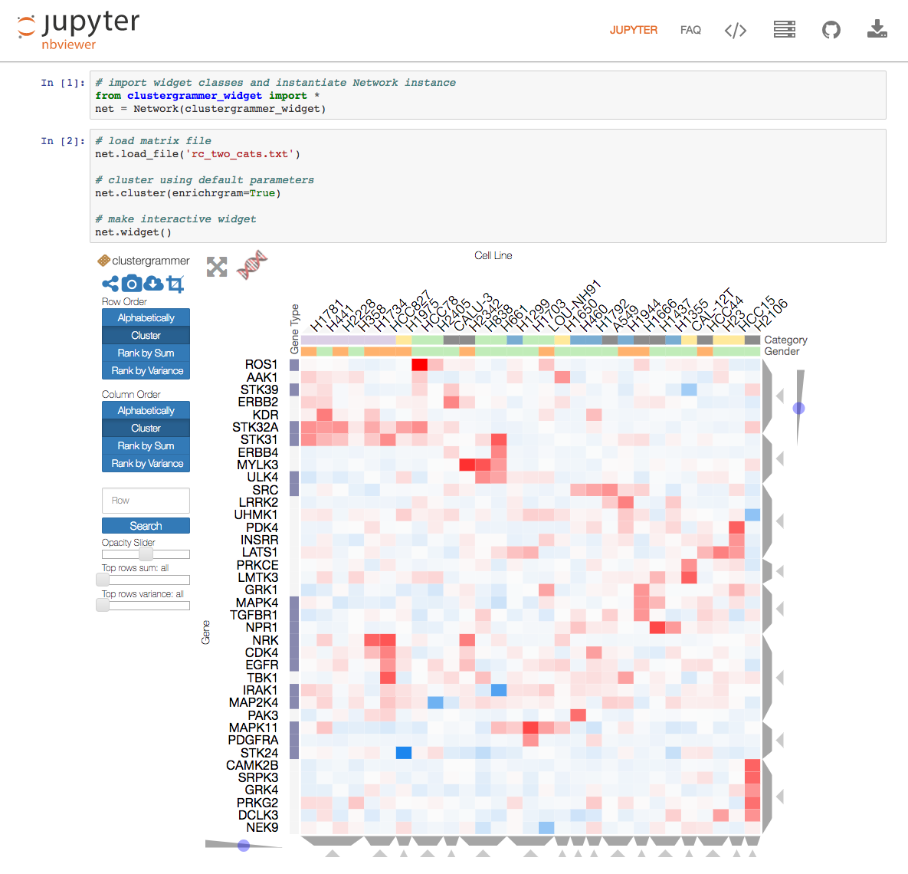

Clustergrammer-Widget
===============================

This is a [Jupyter](http://jupyter.org/) notebook [interactive widget](https://github.com/ipython/ipywidgets) implementation of the interactive heatmap tool [Clustergrammer](https://github.com/MaayanLab/clustergrammer). The front-end visualization, [clustergrammer.js](https://github.com/MaayanLab/clustergrammer) is built using D3.js and the back-end, [clustergrammer.py](https://github.com/MaayanLab/clustergrammer-py) is built in Python.

Please refer to the [Clustergrammer-Widget](http://clustergrammer.readthedocs.io/clustergrammer_widget.html) documentation for more information or click on the screenshot below to see an example notebook.

[](http://nbviewer.jupyter.org/github/MaayanLab/clustergrammer-widget/blob/master/Running_clustergrammer_widget.ipynb)

Installation
------------

The interactive widget can be installed and enabled using the following commands:

    pip install clustergrammer_widget
    jupyter nbextension enable --py --sys-prefix widgetsnbextension
    jupyter nbextension enable --py --sys-prefix clustergrammer_widget

## Dependencies
* Numpy
* Scipy
* Pandas

Clustergrammer-widget is compatable with Python 2 and 3.


# Example Workflow
The Clustergrammer-widget can be used to visualize a matrix of your data in the TSV format described [here](https://github.com/MaayanLab/clustergrammer/tree/working#input-matrix-format).

Within the Jupyter/IPython notebook the widget can be run using the following commands

```
# import the widget
from clustergrammer_widget import *

# load data into new network instance and cluster
net = Network(clustergrammer_widget)
net.load_file('rc_two_cats.txt')
net.cluster()

# view the results as a widget
net.widget()
```

Development Installation
------------------------
For a development installation (requires npm),

    $ git clone https://github.com/maayanlab/clustergrammer-widget.git
    $ cd clustergrammer-widget
    $ pip install -e .
    $ jupyter nbextension install --py --symlink --user clustergrammer_widget
    $ jupyter nbextension enable --py --user clustergrammer_widget
