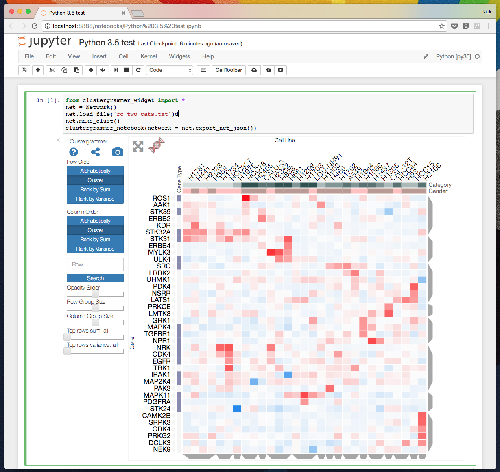

Clustergrammer-Widget
===============================

This is a [Jupyter/IPython](http://jupyter.org/) [interactive widget](https://github.com/ipython/ipywidgets) implementation of the interactive heatmap tool [Clustergrammer](https://github.com/MaayanLab/clustergrammer). The front-end visualization, [clustergrammer.js](https://github.com/MaayanLab/clustergrammer) is built using D3.js and the back-end, [clustergrammer.py](https://github.com/MaayanLab/clustergrammer-py) is built in Python.

[](http://nbviewer.jupyter.org/github/MaayanLab/clustergrammer-widget/blob/master/Python%203.5%20test.ipynb?flush_cache=true)

Installation
------------

To install use pip:

    # python installation
    $ pip install clustergrammer_widget

    # enable widgetsnbextension
    jupyter nbextension enable --py --sys-prefix widgetsnbextension

    # enable widget
    jupyter nbextension enable --py --sys-prefix clustergrammer_widget

## Dependencies
* Numpy
* Scipy
* Pandas

Clustergrammer-widget is compatable with Python 2 and 3.


# Example Workflow
The Clustergrammer-widget can be used to visualize a matrix of your data in the TSV format described [here](https://github.com/MaayanLab/clustergrammer/tree/working#input-matrix-format).

Within the Jupyter/IPython notebook the widget can be run using the following commands

```
# import the widget
from clustergrammer_widget import *
from copy import deepcopy

# load data into new network instance and cluster
net = deepcopy(Network())
net.load_file('rc_two_cats.txt')
net.make_clust()

# view the results as a widget
clustergrammer_widget(network = net.export_net_json())
```

Development Installation
------------------------
For a development installation (requires npm),

    $ git clone https://github.com/maayanlab/clustergrammer-widget.git
    $ cd clustergrammer-widget
    $ pip install -e .
    $ jupyter nbextension install --py --symlink --user clustergrammer-widget
    $ jupyter nbextension enable --py --user clustergrammer-widget
